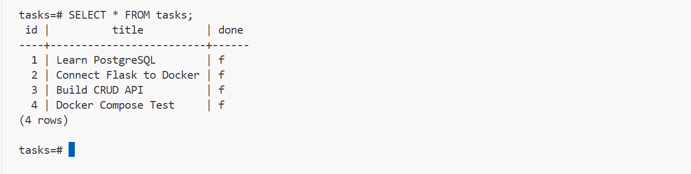

# 🚀 Tiny Backend API with Flask, PostgreSQL & Docker

A production-style REST API built with **Flask**, **PostgreSQL**, and **Docker Compose**. This project demonstrates how to build a backend application that performs full CRUD operations while using a PostgreSQL database running inside Docker containers.

The application automatically creates the database schema, seeds sample data on first run, and can be started with a single Docker Compose command.

---

# 📖 Project Overview

This project demonstrates:

- Building REST APIs using Flask
- PostgreSQL database integration
- Docker containerization
- Docker Compose orchestration
- Environment variable management
- Automatic database initialization
- CRUD operations (Create, Read, Update, Delete)
- Persistent database storage using Docker Volumes

Unlike previous versions that used SQLite, this project uses a real PostgreSQL database server running in its own Docker container, closely matching production backend environments.

---

# ✨ Features

- ✅ RESTful API
- ✅ PostgreSQL Database
- ✅ Dockerized Application
- ✅ Docker Compose
- ✅ Automatic Table Creation
- ✅ Automatic Database Seeding
- ✅ Persistent Storage using Docker Volumes
- ✅ Environment Variables (.env)
- ✅ Parameterized SQL Queries
- ✅ JSON API Responses
- ✅ Error Handling
- ✅ Clean Project Structure

---

# 🛠 Tech Stack

| Technology | Purpose |
|------------|----------|
| Python 3.13 | Programming Language |
| Flask | Web Framework |
| PostgreSQL 17 | Database |
| Psycopg | PostgreSQL Driver |
| Docker | Containerization |
| Docker Compose | Multi-container Management |
| Python Dotenv | Environment Variables |

---

# 📁 Project Structure

```text
tiny-backend/
│
├── app.py
├── db.py
├── docker-compose.yml
├── Dockerfile
├── requirements.txt
├── .env.example
├── .gitignore
├── README.md
└── tasks.db (used in previous assignment)
```

---

# ⚙️ Prerequisites

Install the following:

- Python 3.13+
- Docker Desktop
- Git

---

# 🔑 Environment Variables

Create a `.env` file in the project root.

Example:

```env
DATABASE_URL=postgresql://postgres:dev@db:5432/tasks
```

An example file is already provided:

```
.env.example
```

Simply copy it:

### Windows

```cmd
copy .env.example .env
```

### Linux / macOS

```bash
cp .env.example .env
```

---

# 🚀 Running the Project

## Clone Repository

```bash
git clone https://github.com/mianhasssan/tiny-backend.git
```

```bash
cd tiny-backend
```

---

## Build and Start Everything

```bash
docker compose up --build
```

This single command automatically:

- Builds the Flask application
- Downloads PostgreSQL
- Creates the database
- Creates the tasks table
- Seeds three sample tasks
- Starts both containers

---

## Stop Containers

```bash
docker compose down
```

---

## Rebuild

```bash
docker compose up --build
```

---

# 🌐 API Base URL

```
http://127.0.0.1:5000
```

---

# 📌 API Endpoints

| Method | Endpoint | Description |
|---------|----------|-------------|
| GET | /tasks | Get all tasks |
| GET | /tasks/{id} | Get task by ID |
| POST | /tasks | Create new task |
| PUT | /tasks/{id} | Update task |
| DELETE | /tasks/{id} | Delete task |

---

# 📥 Example Requests

## Get All Tasks

```http
GET /tasks
```

Example:

```bash
curl http://127.0.0.1:5000/tasks
```

Response

```json
[
  {
    "id":1,
    "title":"Learn PostgreSQL",
    "done":false
  },
  {
    "id":2,
    "title":"Connect Flask to Docker",
    "done":false
  },
  {
    "id":3,
    "title":"Build CRUD API",
    "done":false
  }
]
```

---

## Get Single Task

```http
GET /tasks/1
```

---

## Create Task

```http
POST /tasks
```

```bash
curl -X POST http://127.0.0.1:5000/tasks ^
-H "Content-Type: application/json" ^
-d "{\"title\":\"Learn Docker Compose\"}"
```

Response

```json
{
  "id":4,
  "title":"Learn Docker Compose",
  "done":false
}
```

---

## Update Task

```http
PUT /tasks/4
```

```bash
curl -X PUT http://127.0.0.1:5000/tasks/4 ^
-H "Content-Type: application/json" ^
-d "{\"title\":\"Docker Complete\",\"done\":true}"
```

---

## Delete Task

```http
DELETE /tasks/4
```

```bash
curl -X DELETE http://127.0.0.1:5000/tasks/4
```

Returns:

```
204 No Content
```

---

# 🗄 Database

This project uses **PostgreSQL** running inside Docker.

The application automatically:

- Creates the `tasks` table
- Seeds three example tasks
- Connects using environment variables
- Uses parameterized SQL queries
- Stores data inside a Docker Volume

---

## Example SQL Queries

### List all tasks

```sql
SELECT * FROM tasks;
```

### Count tasks

```sql
SELECT COUNT(*) FROM tasks;
```

### Completed tasks

```sql
SELECT * FROM tasks WHERE done = TRUE;
```

### Update tasks

```sql
UPDATE tasks
SET done = TRUE
WHERE id = 1;
```

---

# 💾 Persistent Storage

PostgreSQL data is stored inside a Docker Volume.

```
taskdata
```

This means:

- Stopping containers does **not** delete your data.
- Restarting Docker Compose preserves all tasks.
- Data survives application restarts.

---

# 🐳 Docker Architecture

```
                Browser / curl
                       │
                       ▼
              Flask API Container
                       │
                       ▼
          PostgreSQL Database Container
                       │
                       ▼
              Docker Volume (taskdata)
```

---

# 📷 Screenshots

## PostgreSQL Table

Add your screenshot here.

```
images/postgres-table.png
```

Example:

```markdown

```

---

# 📚 Learning Outcomes

This project helped me learn:

- Flask API Development
- PostgreSQL
- SQL Queries
- CRUD Operations
- Docker
- Docker Compose
- Container Networking
- Environment Variables
- Database Seeding
- Docker Volumes
- REST API Design
- JSON Responses
- Parameterized Queries
- Professional Project Structure

---

# 🔮 Future Improvements

- JWT Authentication
- User Accounts
- Search API
- Pagination
- Filtering
- Unit Testing
- CI/CD Pipeline
- API Documentation (Swagger/OpenAPI)
- SQLAlchemy ORM
- Layered Architecture
- Deployment to Render or Railway

---

# 👨‍💻 Author

**Muhammad Hassan**

Backend Developer | Python Developer | AI & Web Development Enthusiast

**GitHub**

https://github.com/mianhasssan

**LinkedIn**

https://www.linkedin.com/in/mianhasssan

---

# ⭐ Assignment Summary

This project demonstrates a complete backend application using Flask and PostgreSQL running inside Docker containers.

Key achievements include:

- Full REST API
- PostgreSQL Integration
- Docker Containerization
- Docker Compose Setup
- Automatic Database Initialization
- Persistent Storage
- Professional Documentation
- Production-style Project Structure

This project was completed as part of the **FlyRank Backend Internship Program**.